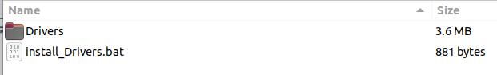
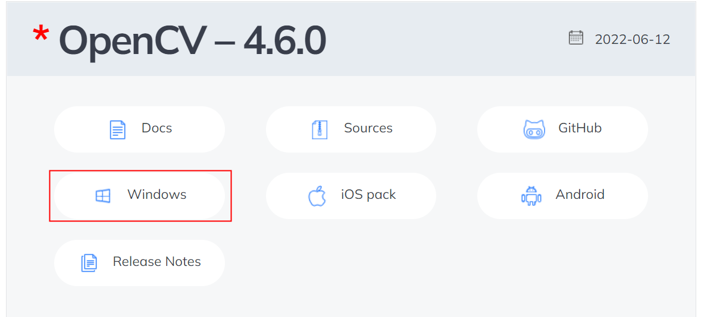

## [Build On Linux](./linux_install_opencv_Driver.md)
# Windows
### Install Driver

[Dowload Driver](https://github.com/ArduCAM/ArduCAM_USB_Camera_Shield/releases/download/install_drivers/install_USB_Camera_Drivers.zip)

Unzip the package after the download is complete.

Double-click to execute the install_driver.bat file.

### Install Opencv

1. download and install ([opencv Releases](https://opencv.org/releases/))

2. add environment variable

